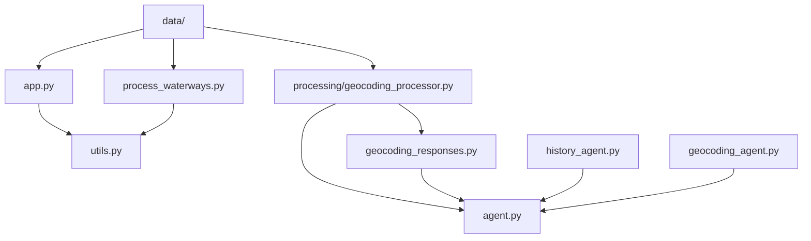

# Romanian Fishing Habitats Explorer

This project provides tools for exploring and processing Romanian fishing habitats data from ANPA (National Agency for Fishing and Aquaculture) for 2025.

## Features

- Interactive Streamlit dashboard for visualizing and exploring fishing habitats data
- KML processing utilities to extract rivers that start from streams and end at confluences with other rivers
- Common utilities for categorizing habitats and extracting location information

## Installation

1. Clone this repository
2. Install dependencies:
   ```
   pip install -r requirements.txt
   ```

## Usage

### Streamlit Dashboard

Run the Streamlit app:
```
streamlit run app.py
```

The dashboard provides:
- Interactive filters for counties and habitat types
- Visualizations showing habitat distributions
- Statistics about habitat areas and lengths
- Association analysis
- Location type analysis (springs, bridges, dams, confluences)
- Search functionality for specific habitat names

### KML Processing

To process the KML file and extract streams that end in rivers:
```
python process_waterways.py
```

This will:
1. Read the KML file with Romanian waterways
2. Extract all streams that end in rivers based on the descriptions
3. Generate a new KML file with only these streams
4. Create a CSV file with metadata about these streams

## Project Structure

- `app.py` - Streamlit dashboard application
- `process_waterways.py` - Script for processing KML waterways data
- `utils.py` - Common utilities for habitat categorization and location extraction
- `data/` - Directory containing the data files
  - `ANPA_habitats_contractate_2025_full.csv` - ANPA contracted habitats data
  - `hotosm_rou_waterways_lines_kml.kml` - KML file with Romanian waterways

### Project Diagram




## Documentation

### Habitat Categorization

The system categorizes habitats into the following types:
- River - Based on the presence of "râul" or "râu" in the name
- Lake/Reservoir - Based on "lac", "balta", or "acumulare"
- Canal - Based on "canal"
- Stream - Based on "pârâul", "pârâu", or "valea"
- Other - Any other type

### Location Types

The system identifies various location types:
- Spring - Starting points that are springs (izvor, izvoare, etc.)
- Bridge - Locations with bridges (pod, podul, etc.)
- Dam/Reservoir - Locations with dams (baraj, acumulare, etc.)
- Confluence - Where streams join rivers (conf., confluență, etc.)
- Boundary - Administrative boundaries (limita, hotar, etc.)
- Entrance - Entrance points (intrare, etc.)
- City - Populated areas

## License

This project is for educational and research purposes only.
